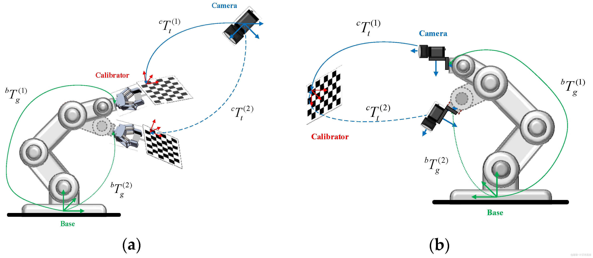

1.相机内参标定
完成像素坐标u，v(x,y)+深度值(物体到相机的距离)Z 到相机坐标系X,Y,Z的转换，Z由TOF传感器或双目相机视差计算获得
原理：透镜成像原理->简化为小孔成像原理
X/x = Z/fx    fx为宽度方向相机焦距 mm
Y/y = Z/fy    fy为高度方向相机焦距 mm
x = (u-cx) *sx  sx为宽度方向像素精度 mm/Pixel
y = (v-cy) *sy  sy为高度方向像素精度 mm/Pixel
X = (Z/fx)*x = (Z/fx)*(u-cx)*sx
Y = (Z/fy)*y = (Z/fy)*(v-cy)*sy
Z = Z
u = (X*fx/Z)/sx + cx -> X*fx/Z + cx    fx为宽度方向相机焦距 Pixel
v = (Y*fy/Z)/sy + cy -> Y*fy/Z + cy    fy为高度方向相机焦距 Pixel
Z = Z
表示为矩阵形式：
    ┌   ┐       ┌            ┐   ┌   ┐
    │ u │       │ fx  0  cx  │   │ X │
Z · │ v │   =   │ 0   fy cy  │ · │ Y │
    │ 1 │       │ 0   0  1   │   │ Z │
    └   ┘       └            ┘   └   ┘
其中fx,fy,cx,cy为相机内参，sx,sy为像素精度，Z为深度值
Z · p = K · P -> K为相机内参矩阵，P为相机坐标系下的3D坐标
对于常见相机，通常K已由厂商给出，不需要重新标定，但有时若厂商未给出或相机发生变化，则需重新标定。即采用已知几何图案如标准棋盘格等，借助数学方法求解K矩阵。

对于已知相机参数K及深度值Z，可求相机任一像素点对应的3D坐标P
P = K^(-1) * Z * p
X = (Z/fx)*x = (Z/fx)*(u-cx)  fx为宽度方向相机焦距 Pixel
Y = (Z/fy)*y = (Z/fy)*(v-cy)  fy为高度方向相机焦距 Pixel
Z = Z

2.相机外参标定
眼在手外-> 需建立机械臂基座坐标系与相机坐标系之间的变换关系 T_cam2base
通过相机内参，深度值Z，像素坐标u,v，已经求出相机坐标系下的3D坐标P_cam-> X,Y,Z

机械臂基座坐标系下的3D坐标P_base = T_cam2base * P_cam = T_grip2base * T_cam2grip* P_cam
其中T_cam2grip为相机坐标系到机械臂末端坐标系之间的变换关系，T_grip2base为机械臂末端坐标系到机械臂基座坐标系之间的变换关系
T_grip2base为机械臂末端坐标系到机械臂基座坐标系之间的变换关系，由机械臂的物理结构决定，通常可采用DH参数法计算获得
故求解T_cam2base = T_grip2base * T_cam2grip，需求解T_cam2grip。